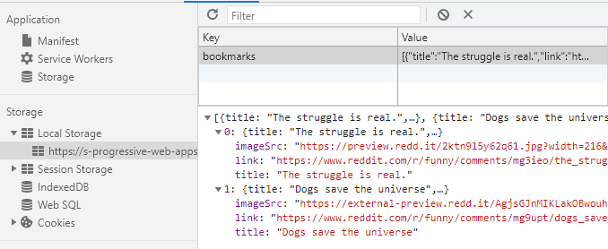

# Read-it
*Read-it is a Reddit PWA that displays hot posts of gives subreddit while focussing on performance*


<table style="margin-left: auto; margin-right: auto;">
    <tr>
        <td align="center"><a href="#live-demo">💻Live demo<a></td>
        <td align="center"><a href="#the-concept">💡 The Concept<a></td>
        <td align="center"><a href="#features">📝Features <a></td>
        <td align="center"><a href="#critical-render-path">📈 Critical render path<a></td>
        <td align="center"><a href="#-installation">🤖 Installation<a></td>
        <td align="center"><a href="#-sources">🤝 Sources<a></td>
        <td align="center"><a href="#-license">📝 License<a></td>
    </tr>
</table>

## 💻Live demo
[Link to the demo](https://s-progressive-web-apps-2021.herokuapp.com/)

## 💡The concept
The main objective of this project is to render data from an API endpoint so, given what is required, I've picked the reddit API. Specifically the listing of posts in subreddits. The data required will be fetched from Reddit's API, which they made open and easy; append .json to a subreddit's url. The landing will list a range of popular subreddits (hardcoded) and each detailpage will list the top posts at that moment. It will be also possible to browse to other subreddits by adding it to the url.

## 📝Features 
* Overview page with popular subreddits
* Detail page for subreddits
* Bookmarking feature

## 📈Critical render path 
In order to improve the loading- and rendering time for this project, I've implemented the following concepts:

### Compression
One way to reduce file sizes is to compress the responses. The files are compressed using the gzip algorithm which effectively compresses and so reduces files sent in responses.


To achieve this, I've implemented the express module (compress)[https://www.npmjs.com/package/compress]

This package helps the express middleware to compress responses sent from the server. 

Without compression: 


Once the responses are compressed, we see the that the file sizes are reduced by an average of `60%`.


### Minifying
JS and CSS files tend to increase in size because of the `newline` entries in the file. For us humans, it helps to have lines of code spread over multiple lines but for a compiler, however, it does not matter. 

To minify CSS and JS, I've used the express module `minify` see [minify](https://www.npmjs.com/package/express-minify).


In this screenshot, we see that the files are quite big and so require more bandwidth to load properly.

After minifying, deleting the `newlines`, we see that the file sizes are reduced drastically:


### Service worker
Once the files are minified and compress, there remains one last optimization; caching files on the client. 

This approach is effective after the initial load, so that the files are available to the client.

Using the service worker, the application can cache the requests it makes. Specifically to this use case, it was important to me to at least keep the styling and pages, the images would be nice but weren't essential (and we don't want to pollute the client's storage).

When the service worker is loaded and activated, it does an initial cache. For this, it takes an array with paths to the files that need to be cached.

```js
const cacheURLs = ['./askreddit.html', './funny.html', etc etc]

if ('serviceWorker' in navigator) {
  navigator.serviceWorker.register('service-worker.js', {
    scope: '.' 
  }).then(function (registration) {
    const cache = await caches.open(cacheName)

    cacheURLs.map(key => cache.add(key));
  }, function (err) {
    ... error handling
  });
}
```

Once cached, the files will show up in the `cache storage` on the client's browser. 


The real magic happens when the service worker actually returns files from cache. This is done using the code: 

```js
self.addEventListener('fetch', event => {
  event.respondWith(
    caches.match(event.request)
      .then(response => {
        // if it's in cache, return cached
        if (response) return response
        // if it's not in cache, make request
        return fetch(event.request)
      }).catch(error => {
        // if its not possible to make request, return offline page
        return caches.match(offlinePage);
      })
  );
});
```

Now, if we reload the page, and look at the network tab in dev tools, we notice that files are served by `service worker` meaning that the service worker recognized the request, found it in cache, and then returned it without needing internet.


### Conclusion
To conclude the optimization, after optimizing every bit of the application, we run one last audit using Chrome's Lighthouse. We run the audit on `performance`, `accessibility`, and `best practices`

The audit will determine the application's performance and returns scores as well as recommendations for improvement.

The main overview- and homepage, passed the audit with all 100% scores and no further required improvements.


The detail pages (which are the subreddits) scored just like the overview page. It scored 100 on all sections with no further required improvements.


The application scored 100% for the PWA section with no further required improvements.


### Noteworthy features
To improve performance and ux a little more, I implemented two additional features.

**Bookmarking**
Users that have javascript enabled, are able to bookmark posts.

When javascript runs (or at least not blocked), the scripts renders a form with button to each item in the detailpage. 


Clicking this button saves the post in the localStorage.



Once saved, the user will be able to find them back on the overview page right below the subreddit listing:


**Server-side caching**
To take performance one step further, the server utilizes server-side caching. Subreddits mentioned on the overview page have their contents pre-cached. 

This leads to faster initial loading times when there is no client-side caching happening (so no service worker).

Subreddits that are not listed on the overview page, are cached when it's has not been cached previously. Here's a sample of that logic: 

```js
/**
 * Function makes an API calls and caches them if they're not cached before
 * @param {String} subreddit - subreddit to request 
 */
async function getSubredditData(subreddit) {
  return cache.getCache(subreddit)
    ? await cache.getCache(subreddit)
    : await fetchData(subreddit);
}

/**
 * Function makes an API calls and caches them if they're not cached before or sets not found if they don't exist
 * @param {String} subreddit - subreddit to request 
 */
async function fetchData(subreddit) {
  return await axios
    .get("https://www.reddit.com/r/" + subreddit + ".json", {
      headers: { "X-Requested-With": "randomstring" },
    })
    .then((response) => {
      return response.data.data.children.length == 0
        ?
        // return not found if sub is not found 
        {
            timestamp: +new Date(),
            title: "Not found",
            data: [],
          }
        : (
            // cache the data
            cache.setCache(subreddit, {
            timestamp: +new Date(),
            title: "r/" + subreddit,
            data: response.data.data.children,
          }),
            // return the same data you set in cache
          {
            timestamp: +new Date(),
            title: "r/" + subreddit,
            data: response.data.data.children,
          });
    })
    .catch((error) => console.log(error.status));
}
```

To prove that it is super efficient, I've disabled the service worker and made a request to a subreddit that is not listed in the overview page; /r/roastme (this is not an invitation to actually roast this code LOL). 

Here we see that the request takes over 800ms to load (this depends on your server's internet speed)


The second time that the subreddit is called, the server returns the cached data along with the template engine, this reduces the load time by nearly `5900%`


## 🤖 Installation
**Run the project:**
1. Install dependencies
`npm install`
2. Run project
`npm run start`


## 🤝 Sources
[Data by Reddit](https://s-progressive-web-apps-2021.herokuapp.com/)  
[Base project](https://github.com/sjagoori/progressive-web-apps-2021)    
[Build inspiration by Declan](https://github.com/decrek)


## 📝 License
[GPLv3](https://choosealicense.com/licenses/mit/)


